# lego-brickbase

## Purpose

This project showcases the complete engineering workflow of integrating the LEGO brickbase API and database into a unified data model on Databricks, covering data ingestion, transformation with PySpark, and tabular modeling for Power BI reporting.

## Solution Design

## Domain Data Model

## Conceptual Data Model

## Logical Data Model

```mermaid
---
title: LEGO Brickbase Data Warehouse
config:
    layout: elk
    scale: 2
---
erDiagram
    direction LR

    %% ── Dimension Tables ──────────────────────────────────────────────────────

    dim_theme_hierarchy:::dim {
        INTEGER theme_key       PK
        INTEGER theme_id
        STRING  theme_name
        INTEGER parent_theme_id
        STRING  parent_theme_name
        STRING  root_theme_name
        INTEGER hierarchy_depth
    }

    dim_set:::dim {
        STRING    set_key                   PK
        INTEGER   theme_key                 FK
        STRING    set_number
        STRING    set_name
        INTEGER   year
        STRING    theme_name
        STRING    parent_theme_name
        STRING    root_theme_name
        INTEGER   number_of_parts
        BIGINT    number_of_unique_parts
        BIGINT    number_of_unique_colors
        BIGINT    total_part_quantity
        BIGINT    number_of_minifigs
        STRING    set_image_url
        STRING    set_url
        TIMESTAMP source_last_modified_date
    }

    dim_part:::dim {
        STRING  part_key              PK
        STRING  part_number
        STRING  part_name
        STRING  part_category_name
        INTEGER year_from
        INTEGER year_to
        INTEGER production_span_years
        BOOLEAN is_active
        STRING  part_url
        STRING  part_image_url
        STRING  external_ids
    }

    dim_color:::dim {
        INTEGER color_key       PK
        INTEGER color_id
        STRING  color_name
        STRING  rgb
        BOOLEAN is_transperent
        STRING  color_family
    }

    %% ── Fact Tables ───────────────────────────────────────────────────────────

    fct_set_inventory:::fct {
        INTEGER inventory_id         PK
        STRING  part_key             PK
        INTEGER color_key            PK
        STRING  set_key              FK
        STRING  set_number
        STRING  set_name
        INTEGER year
        STRING  theme_name
        STRING  root_theme_name
        STRING  part_name
        STRING  part_category_name
        STRING  color_name
        STRING  color_rgb
        BOOLEAN is_transparent_color
        INTEGER quantity
        BOOLEAN is_spare
        STRING  image_url
    }

    fct_set_minifigs:::fct {
        STRING  set_key                 PK
        STRING  minifig_key             PK
        STRING  set_number
        STRING  set_name
        INTEGER year
        STRING  theme_name
        STRING  root_theme_name
        STRING  minifig_set_number
        STRING  minifigs_name
        INTEGER minifig_number_of_parts
        INTEGER quantity
        STRING  minifig_set_image_url
    }

    fct_set_composition:::fct {
        STRING  set_key                PK
        STRING  set_number
        STRING  set_name
        INTEGER year
        STRING  theme_name
        STRING  root_theme_name
        BIGINT  total_parts
        BIGINT  total_unique_parts
        BIGINT  total_unique_colors
        DOUBLE  pct_transparent_parts
        DOUBLE  pct_spare_parts
        STRING  dominant_color_name
        STRING  dominant_part_category
        BIGINT  number_of_minifigs
    }

    fct_color_usage:::fct {
        INTEGER color_key                  PK
        STRING  color_name
        STRING  rgb
        STRING  color_family
        BOOLEAN is_transperent
        BIGINT  total_sets_featuring_color
        BIGINT  total_parts_in_color
        BIGINT  total_quantity
        BIGINT  distinct_part_categories
        STRING  top_theme
    }

    fct_part_usage:::fct {
        STRING  part_key                     PK
        STRING  part_name
        STRING  part_category_name
        BOOLEAN is_active
        BIGINT  total_sets_used_in
        BIGINT  total_themes_used_in
        BIGINT  total_quantity_across_sets
        STRING  most_common_color
        BIGINT  distinct_colors_available_in
        INTEGER first_year_appeared
        INTEGER latest_year_appeared
    }

    fct_theme_summary:::fct {
        STRING  theme_key        PK
        STRING  theme_name
        STRING  root_theme_name
        BIGINT  total_sets
        DOUBLE  avg_parts_per_set
        BIGINT  total_minifigs
        INTEGER year_first_set
        INTEGER year_latest_set
        INTEGER active_span_years
        BIGINT  unique_parts_used
        BIGINT  unique_colors_used
    }

    %% ── Relationships ─────────────────────────────────────────────────────────

    dim_theme_hierarchy ||--o{ dim_set            : "theme_key"

    dim_set             ||--o{ fct_set_inventory  : "set_key"
    dim_part            ||--o{ fct_set_inventory  : "part_key"
    dim_color           ||--o{ fct_set_inventory  : "color_key"

    dim_set             ||--o{ fct_set_minifigs   : "set_key"

    dim_set             ||--|| fct_set_composition : "set_key"

    dim_color           ||--|| fct_color_usage    : "color_key"

    dim_part            ||--|| fct_part_usage     : "part_key"

    dim_set             }o--|| fct_theme_summary  : "theme_key"

    %% Styling
    classDef dim stroke:#f90,stroke-width:2px
    classDef fct stroke:#06f,stroke-width:2px
```

