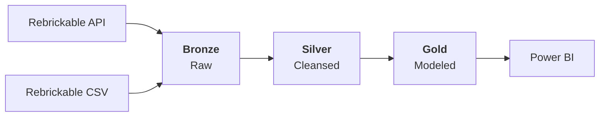

# Solution Architecture

[< Back to Solution Outline](README.md)

---

## High-Level Architecture

The architecture follows a **Lakehouse** pattern on Databricks with three distinct layers aligned to the **Medallion Architecture**:

## Layer Responsibilities

| Layer | Purpose | Storage Format | Catalog Schema |
|---|---|---|---|
| **Bronze** | Raw ingestion with SCD2 history tracking | Delta (via Parquet staging) | `lego_brickbase.bronze` |
| **Silver** | Cleansed, conformed, and deduplicated foundation tables | Delta | `lego_brickbase.silver` |
| **Gold** | Dimensional and fact tables optimised for analytical consumption | Delta | `lego_brickbase.gold` |

## Data Flow Overview

1. **Extract** - Databricks notebooks fetch data from the Rebrickable REST API (paginated, rate-limited) and CSV file uploads.
2. **Load (Bronze)** - Raw data is written as Parquet to external volumes, then merged into Delta tables using an SCD Type 2 pattern with audit metadata.
3. **Transform (Silver)** - Foundation notebooks read current Bronze records, apply key standardisation, column aliasing, and filtering, then write cleansed Delta tables.
4. **Model (Gold)** - Dimensional notebooks join, aggregate, and enrich Silver tables into star-schema dimensions and facts, registered with constraints and descriptions.
5. **Consume** - Power BI connects to Gold layer tables via the Databricks SQL endpoint for interactive reporting.
