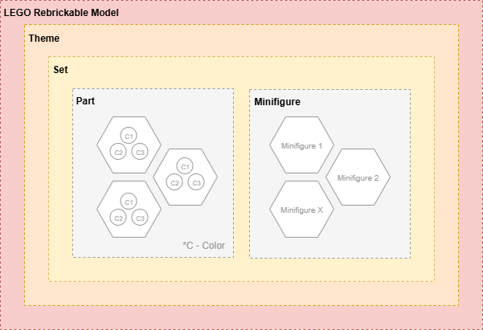
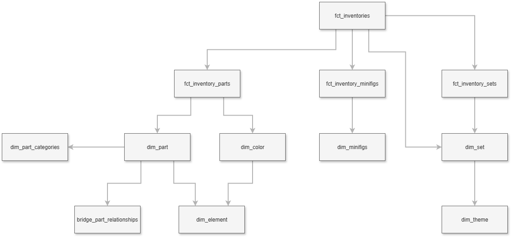

# Conceptual Data Model

[< Back to Solution Outline](README.md)

---

## Domain Model

The LEGO Rebrickable domain is organised around the following core entities:

- **Theme** - A hierarchical classification for LEGO sets (e.g., *Star Wars > Star Wars Episode IV*). Themes can be nested up to multiple levels.
- **Set** - A packaged LEGO product identified by a set number (e.g., `75192-1`). Each set belongs to a single theme and has a release year.
- **Part** - A distinct LEGO brick or element identified by a part number. Parts belong to a category (e.g., *Technic Beams*) and can appear across many sets.
- **Colour** - A named colour with an RGB value and transparency flag. Parts are manufactured in specific colours.
- **Minifigure** - A LEGO minifigure included within a set, itself composed of parts.
- **Inventory** - A bill-of-materials linking a set to its constituent parts (with colour and quantity) and minifigures.

## Conceptual Data Model

The conceptual model above shows the intended dimensional structure prior to physical implementation. Key relationships:

- A **Set** belongs to one **Theme**; a Theme can have many Sets.
- A **Set** contains many **Parts** (via Inventory), each in a specific **Colour** and quantity.
- A **Set** may include zero or more **Minifigures** (via Inventory).
- **Themes** form a self-referencing hierarchy (parent/child).
