# Logical Data Model

[< Back to Solution Outline](README.md)

---

## Entity Relationship Diagram

```mermaid
---
title: LEGO Brickbase Data Warehouse
config:
    layout: elk
    scale: 2
---
erDiagram
    direction LR

    %% Dimension Tables

    dim_theme_hierarchy {
        INTEGER theme_key       PK
        INTEGER theme_id
        STRING  theme_name
        INTEGER parent_theme_id
        STRING  parent_theme_name
        STRING  root_theme_name
        INTEGER hierarchy_depth
    }

    dim_set {
        STRING    set_key                   PK
        INTEGER   theme_key                 FK
        STRING    set_number
        STRING    set_name
        INTEGER   year
        STRING    theme_name
        STRING    parent_theme_name
        STRING    root_theme_name
        INTEGER   number_of_parts
        BIGINT    number_of_unique_parts
        BIGINT    number_of_unique_colors
        BIGINT    total_part_quantity
        BIGINT    number_of_minifigs
        STRING    set_image_url
        STRING    set_url
        TIMESTAMP source_last_modified_date
    }

    dim_part {
        STRING  part_key              PK
        STRING  part_number
        STRING  part_name
        STRING  part_category_name
        INTEGER year_from
        INTEGER year_to
        INTEGER production_span_years
        BOOLEAN is_active
        STRING  part_url
        STRING  part_image_url
        STRING  external_ids
    }

    dim_color {
        INTEGER color_key       PK
        INTEGER color_id
        STRING  color_name
        STRING  rgb
        BOOLEAN is_transperent
        STRING  color_family
    }

    %% Fact Tables

    fct_set_inventory {
        INTEGER inventory_id         PK
        STRING  part_key             PK
        INTEGER color_key            PK
        STRING  set_key              FK
        STRING  set_number
        STRING  set_name
        INTEGER year
        STRING  theme_name
        STRING  root_theme_name
        STRING  part_name
        STRING  part_category_name
        STRING  color_name
        STRING  color_rgb
        BOOLEAN is_transparent_color
        INTEGER quantity
        BOOLEAN is_spare
        STRING  image_url
    }

    fct_set_minifigs {
        STRING  set_key                 PK
        STRING  minifig_key             PK
        STRING  set_number
        STRING  set_name
        INTEGER year
        STRING  theme_name
        STRING  root_theme_name
        STRING  minifig_set_number
        STRING  minifigs_name
        INTEGER minifig_number_of_parts
        INTEGER quantity
        STRING  minifig_set_image_url
    }

    fct_set_composition {
        STRING  set_key                PK
        STRING  set_number
        STRING  set_name
        INTEGER year
        STRING  theme_name
        STRING  root_theme_name
        BIGINT  total_parts
        BIGINT  total_unique_parts
        BIGINT  total_unique_colors
        DOUBLE  pct_transparent_parts
        DOUBLE  pct_spare_parts
        STRING  dominant_color_name
        STRING  dominant_part_category
        BIGINT  number_of_minifigs
    }

    fct_color_usage {
        INTEGER color_key                  PK
        STRING  color_name
        STRING  rgb
        STRING  color_family
        BOOLEAN is_transperent
        BIGINT  total_sets_featuring_color
        BIGINT  total_parts_in_color
        BIGINT  total_quantity
        BIGINT  distinct_part_categories
        STRING  top_theme
    }

    fct_part_usage {
        STRING  part_key                     PK
        STRING  part_name
        STRING  part_category_name
        BOOLEAN is_active
        BIGINT  total_sets_used_in
        BIGINT  total_themes_used_in
        BIGINT  total_quantity_across_sets
        STRING  most_common_color
        BIGINT  distinct_colors_available_in
        INTEGER first_year_appeared
        INTEGER latest_year_appeared
    }

    fct_theme_summary {
        STRING  theme_key        PK
        STRING  theme_name
        STRING  root_theme_name
        BIGINT  total_sets
        DOUBLE  avg_parts_per_set
        BIGINT  total_minifigs
        INTEGER year_first_set
        INTEGER year_latest_set
        INTEGER active_span_years
        BIGINT  unique_parts_used
        BIGINT  unique_colors_used
    }

    %% Relationships

    dim_theme_hierarchy ||--o{ dim_set            : "theme_key"

    dim_set             ||--o{ fct_set_inventory  : "set_key"
    dim_part            ||--o{ fct_set_inventory  : "part_key"
    dim_color           ||--o{ fct_set_inventory  : "color_key"

    dim_set             ||--o{ fct_set_minifigs   : "set_key"

    dim_set             ||--|| fct_set_composition : "set_key"

    dim_color           ||--|| fct_color_usage    : "color_key"

    dim_part            ||--|| fct_part_usage     : "part_key"

    dim_set             }o--|| fct_theme_summary  : "theme_key"

    %% Styling
    classDef dim stroke:#f90,stroke-width:2px
    classDef fct stroke:#06f,stroke-width:2px
```

---

## Key Relationships

| Relationship | Cardinality | Join Key | Description |
|---|---|---|---|
| `dim_theme_hierarchy` to `dim_set` | One-to-Many | `theme_key` | Each set belongs to exactly one theme |
| `dim_set` to `fct_set_inventory` | One-to-Many | `set_key` | A set has many inventory line items |
| `dim_part` to `fct_set_inventory` | One-to-Many | `part_key` | A part appears in many set inventories |
| `dim_color` to `fct_set_inventory` | One-to-Many | `color_key` | A colour appears in many inventory lines |
| `dim_set` to `fct_set_minifigs` | One-to-Many | `set_key` | A set can include many minifigures |
| `dim_set` to `fct_set_composition` | One-to-One | `set_key` | One composition summary per set |
| `dim_color` to `fct_color_usage` | One-to-One | `color_key` | One usage summary per colour |
| `dim_part` to `fct_part_usage` | One-to-One | `part_key` | One usage summary per part |
| `dim_set` to `fct_theme_summary` | Many-to-One | `theme_key` | Many sets roll up to one theme summary |

---

## Constraint Strategy

All Gold layer tables are registered in Unity Catalog with:

- **PRIMARY KEY** constraints on dimension and fact tables (informational, not enforced by Databricks)
- **FOREIGN KEY** references from fact tables to their parent dimensions
- **NOT NULL** constraints on surrogate key columns
- **COMMENT** annotations on every table and column for discoverability
