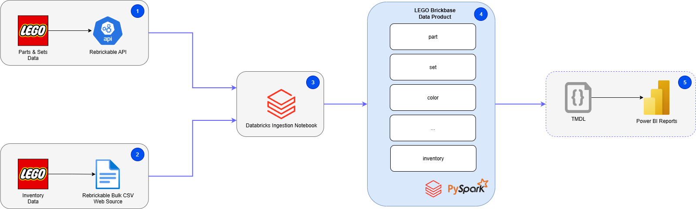
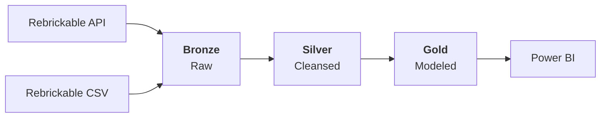

# Solution Outline Document

| | |
|---|---|
| **Project** | LEGO Brickbase |
| **Version** | 1.0.0 |
| **Date** | 2026-04-12 |
| **Status** | Active Development |
| **Repository** | [rs-vijayavasanth/lego-brickbase](https://github.com/rs-vijayavasanth/lego-brickbase) |

---

## Table of Contents

1. [Summary](#1-summary)
2. [Contributors](#2-contributors)
3. [Solution Architecture](#3-solution-architecture)
4. [Conceptual Data Model](#4-conceptual-data-model)
5. [Core Data Building Blocks](#5-core-data-building-blocks)
6. [Logical Data Model](#6-logical-data-model)
7. [Technology Components](#7-technology-components)
8. [Integration](#8-integration)
9. [Data Pipeline](#9-data-pipeline)
10. [Deployment](#10-deployment)
11. [Security](#11-security)
12. [Governance and Compliance](#12-governance-and-compliance)
13. [Non-Functional Requirements](#13-non-functional-requirements)
14. [Future Considerations](#14-future-considerations)

---

## 1. Summary

### 1.1 Purpose

LEGO Brickbase is a data engineering project that demonstrates the complete workflow of integrating LEGO brick data from the [Rebrickable](https://rebrickable.com/) API and database into a unified analytical data model on Databricks. The solution covers data ingestion, transformation with PySpark, dimensional modeling, and tabular modeling for Power BI reporting.

### 1.2 Business Context

The LEGO ecosystem consists of thousands of sets, parts, colours, themes, and minifigures with complex relationships between them. Rebrickable maintains a comprehensive open dataset that catalogues this information. This project transforms that raw data into an analytics-ready data warehouse that supports questions such as:

- Which themes have the most sets and parts over time?
- What is the colour composition of a given set?
- Which parts appear across the most sets and themes?
- How do sets compare in complexity (unique parts, colours, minifigures)?

### 1.3 Scope

| In Scope | Out of Scope |
|---|---|
| Ingestion from Rebrickable REST API (v3) | Real-time / streaming ingestion |
| Ingestion from Rebrickable CSV exports | User-contributed data or MOC (My Own Creation) sets |
| Medallion architecture (Bronze, Silver, Gold) | Machine learning or predictive analytics |
| Dimensional modeling for analytical queries | Multi-tenant or multi-environment deployment |
| Power BI semantic model and reporting | Automated alerting and monitoring |
| Unity Catalog registration and governance | Data sharing or marketplace publishing |

### 1.4 Key Decisions

| Decision | Rationale |
|---|---|
| PySpark over dbt | Full control over transformations within the Databricks notebook environment; removed the need for an additional tool in the stack (changed in v0.2.0) |
| SCD Type 2 in Bronze | Preserves full history of changes from the source system, enabling point-in-time analysis and audit |
| Delta Lake throughout | ACID transactions, schema enforcement, time travel, and seamless Unity Catalog integration |
| Surrogate keys in Gold | Stable join keys decoupled from source natural keys, improving resilience to upstream changes |

---

## 2. Contributors

| Name | Role | Responsibility |
|---|---|---|
| RS Vijayavasanth | Data Engineer / Architect | Solution design, data modeling, pipeline development, documentation |

---

## 3. Solution Architecture

### 3.1 High-Level Architecture



The architecture follows a **Lakehouse** pattern on Databricks with three distinct layers aligned to the **Medallion Architecture**:



### 3.2 Layer Responsibilities

| Layer | Purpose | Storage Format | Catalog Schema |
|---|---|---|---|
| **Bronze** | Raw ingestion with SCD2 history tracking | Delta (via Parquet staging) | `lego_brickbase.bronze` |
| **Silver** | Cleansed, conformed, and deduplicated foundation tables | Delta | `lego_brickbase.silver` |
| **Gold** | Dimensional and fact tables optimised for analytical consumption | Delta | `lego_brickbase.gold` |

### 3.3 Data Flow Overview

1. **Extract** - Databricks notebooks fetch data from the Rebrickable REST API (paginated, rate-limited) and CSV file uploads.
2. **Load (Bronze)** - Raw data is written as Parquet to external volumes, then merged into Delta tables using an SCD Type 2 pattern with audit metadata.
3. **Transform (Silver)** - Foundation notebooks read current Bronze records, apply key standardisation, column aliasing, and filtering, then write cleansed Delta tables.
4. **Model (Gold)** - Dimensional notebooks join, aggregate, and enrich Silver tables into star-schema dimensions and facts, registered with constraints and descriptions.
5. **Consume** - Power BI connects to Gold layer tables via the Databricks SQL endpoint for interactive reporting.

---

## 4. Conceptual Data Model

### 4.1 Domain Model


The LEGO Rebrickable domain is organised around the following core entities:

- **Theme** - A hierarchical classification for LEGO sets (e.g., *Star Wars > Star Wars Episode IV*). Themes can be nested up to multiple levels.
- **Set** - A packaged LEGO product identified by a set number (e.g., `75192-1`). Each set belongs to a single theme and has a release year.
- **Part** - A distinct LEGO brick or element identified by a part number. Parts belong to a category (e.g., *Technic Beams*) and can appear across many sets.
- **Colour** - A named colour with an RGB value and transparency flag. Parts are manufactured in specific colours.
- **Minifigure** - A LEGO minifigure included within a set, itself composed of parts.
- **Inventory** - A bill-of-materials linking a set to its constituent parts (with colour and quantity) and minifigures.

### 4.2 Conceptual Data Model


The conceptual model above shows the intended dimensional structure prior to physical implementation. Key relationships:

- A **Set** belongs to one **Theme**; a Theme can have many Sets.
- A **Set** contains many **Parts** (via Inventory), each in a specific **Colour** and quantity.
- A **Set** may include zero or more **Minifigures** (via Inventory).
- **Themes** form a self-referencing hierarchy (parent/child).

---

## 5. Core Data Building Blocks

### 5.1 Source Entities

The project ingests **10 source entities** from Rebrickable, split across two ingestion methods:

#### API-Sourced Entities

| Entity | API Endpoint | Natural Key | Description |
|---|---|---|---|
| Colors | `/lego/colors/` | `id` | LEGO colour catalogue with RGB values |
| Themes | `/lego/themes/` | `id` | Hierarchical theme classification |
| Sets | `/lego/sets/` | `set_num` | Official LEGO set catalogue |
| Parts | `/lego/parts/` | `part_num` | Individual brick/element catalogue |
| Part Categories | `/lego/part_categories/` | `id` | Part classification groups |
| Minifigs | `/lego/minifigs/` | `set_num` | Minifigure catalogue |

#### CSV-Sourced Entities

| Entity | File | Natural Key | Description |
|---|---|---|---|
| Inventories | `inventories.csv` | `id` | Bill-of-materials header linking sets to contents |
| Inventory Parts | `inventory_parts.csv` | `inventory_id` + `part_num` + `color_id` | Part-colour-quantity per inventory |
| Inventory Minifigs | `inventory_minifigs.csv` | `inventory_id` + `fig_num` | Minifigure-quantity per inventory |
| Inventory Sets | `inventory_sets.csv` | `inventory_id` + `set_num` | Sub-set references per inventory |

### 5.2 Bronze Layer - Raw Tables

Each source entity maps to a Bronze Delta table with the following standardised audit and SCD2 columns:

| Column | Type | Purpose |
|---|---|---|
| `_load_datetime` | `TIMESTAMP` | When the record was ingested |
| `_record_source` | `STRING` | Origin of the record (`API` or `CSV`) |
| `valid_from` | `TIMESTAMP` | When this version of the record became current |
| `valid_to` | `TIMESTAMP` | When this version was superseded (NULL if current) |
| `is_current` | `BOOLEAN` | Whether this is the latest version |
| `is_deleted` | `BOOLEAN` | Whether the record was soft-deleted from source |

**Bronze Tables:**

| Catalog Table | Natural Key |
|---|---|
| `lego_brickbase.bronze.raw_colors` | `id` |
| `lego_brickbase.bronze.raw_themes` | `id` |
| `lego_brickbase.bronze.raw_sets` | `set_num` |
| `lego_brickbase.bronze.raw_parts` | `part_num` |
| `lego_brickbase.bronze.raw_part_categories` | `id` |
| `lego_brickbase.bronze.raw_minifigs` | `set_num` |
| `lego_brickbase.bronze.raw_inventories` | `id` |
| `lego_brickbase.bronze.raw_inventory_parts` | `inventory_id` + `part_num` + `color_id` |
| `lego_brickbase.bronze.raw_inventory_minifigs` | `inventory_id` + `fig_num` |
| `lego_brickbase.bronze.raw_inventory_sets` | `inventory_id` + `set_num` |

### 5.3 Silver Layer - Foundation Tables

Foundation tables apply the following standardisations to Bronze data:

- **Filter** to `is_current = true` and `is_deleted = false` records only
- **Rename** natural keys to a consistent `{entity}_key` convention (e.g., `set_num` becomes `set_key`)
- **Alias** columns to business-friendly names
- **Partition** by `valid_from_date` for query performance

**Silver Tables:**

| Catalog Table | Surrogate Key | Source Bronze Table |
|---|---|---|
| `lego_brickbase.silver.foundation_colors` | `color_key` | `raw_colors` |
| `lego_brickbase.silver.foundation_themes` | `theme_key` | `raw_themes` |
| `lego_brickbase.silver.foundation_sets` | `set_key` | `raw_sets` |
| `lego_brickbase.silver.foundation_parts` | `part_key` | `raw_parts` |
| `lego_brickbase.silver.foundation_part_categories` | `part_category_key` | `raw_part_categories` |
| `lego_brickbase.silver.foundation_minifigs` | `minifig_key` | `raw_minifigs` |
| `lego_brickbase.silver.foundation_inventories` | `inventory_id` | `raw_inventories` |
| `lego_brickbase.silver.foundation_inventory_parts` | `inventory_id` + `part_key` + `color_key` | `raw_inventory_parts` |
| `lego_brickbase.silver.foundation_inventory_minifigs` | `inventory_id` + `minifig_key` | `raw_inventory_minifigs` |
| `lego_brickbase.silver.foundation_inventory_sets` | `inventory_id` + `set_key` | `raw_inventory_sets` |

### 5.4 Gold Layer - Dimensional Model

The Gold layer implements a **star schema** with 4 dimension tables and 6 fact tables. See [Section 6: Logical Data Model](#6-logical-data-model) for the full schema.

#### Dimensions

| Table | Grain | Key | Description |
|---|---|---|---|
| `dim_theme_hierarchy` | One row per theme | `theme_key` (INTEGER) | Theme hierarchy with resolved parent/root names and depth |
| `dim_set` | One row per set | `set_key` (STRING) | Sets enriched with theme info and pre-aggregated inventory metrics |
| `dim_part` | One row per part | `part_key` (STRING) | Parts with category, production year range, and active status |
| `dim_color` | One row per colour | `color_key` (INTEGER) | Colours with RGB, transparency flag, and derived colour family |

#### Facts

| Table | Grain | Composite Key | Description |
|---|---|---|---|
| `fct_set_inventory` | One row per part-colour in an inventory | `inventory_id` + `part_key` + `color_key` | Detailed bill-of-materials for each set |
| `fct_set_minifigs` | One row per minifigure in a set | `set_key` + `minifig_key` | Minifigures included in each set |
| `fct_set_composition` | One row per set | `set_key` | Set-level aggregate metrics (unique parts, colours, transparency %, spare %, dominant colour/category) |
| `fct_color_usage` | One row per colour | `color_key` | Colour-level usage metrics across the catalogue |
| `fct_part_usage` | One row per part | `part_key` | Part-level usage metrics across sets and themes |
| `fct_theme_summary` | One row per theme | `theme_key` | Theme-level aggregate metrics (total sets, avg parts, year span) |

---

## 6. Logical Data Model

### 6.1 Entity Relationship Diagram

```mermaid
---
title: LEGO Brickbase Data Warehouse
config:
    layout: elk
    scale: 2
---
erDiagram
    direction LR

    %% Dimension Tables

    dim_theme_hierarchy {
        INTEGER theme_key       PK
        INTEGER theme_id
        STRING  theme_name
        INTEGER parent_theme_id
        STRING  parent_theme_name
        STRING  root_theme_name
        INTEGER hierarchy_depth
    }

    dim_set {
        STRING    set_key                   PK
        INTEGER   theme_key                 FK
        STRING    set_number
        STRING    set_name
        INTEGER   year
        STRING    theme_name
        STRING    parent_theme_name
        STRING    root_theme_name
        INTEGER   number_of_parts
        BIGINT    number_of_unique_parts
        BIGINT    number_of_unique_colors
        BIGINT    total_part_quantity
        BIGINT    number_of_minifigs
        STRING    set_image_url
        STRING    set_url
        TIMESTAMP source_last_modified_date
    }

    dim_part {
        STRING  part_key              PK
        STRING  part_number
        STRING  part_name
        STRING  part_category_name
        INTEGER year_from
        INTEGER year_to
        INTEGER production_span_years
        BOOLEAN is_active
        STRING  part_url
        STRING  part_image_url
        STRING  external_ids
    }

    dim_color {
        INTEGER color_key       PK
        INTEGER color_id
        STRING  color_name
        STRING  rgb
        BOOLEAN is_transperent
        STRING  color_family
    }

    %% Fact Tables

    fct_set_inventory {
        INTEGER inventory_id         PK
        STRING  part_key             PK
        INTEGER color_key            PK
        STRING  set_key              FK
        STRING  set_number
        STRING  set_name
        INTEGER year
        STRING  theme_name
        STRING  root_theme_name
        STRING  part_name
        STRING  part_category_name
        STRING  color_name
        STRING  color_rgb
        BOOLEAN is_transparent_color
        INTEGER quantity
        BOOLEAN is_spare
        STRING  image_url
    }

    fct_set_minifigs {
        STRING  set_key                 PK
        STRING  minifig_key             PK
        STRING  set_number
        STRING  set_name
        INTEGER year
        STRING  theme_name
        STRING  root_theme_name
        STRING  minifig_set_number
        STRING  minifigs_name
        INTEGER minifig_number_of_parts
        INTEGER quantity
        STRING  minifig_set_image_url
    }

    fct_set_composition {
        STRING  set_key                PK
        STRING  set_number
        STRING  set_name
        INTEGER year
        STRING  theme_name
        STRING  root_theme_name
        BIGINT  total_parts
        BIGINT  total_unique_parts
        BIGINT  total_unique_colors
        DOUBLE  pct_transparent_parts
        DOUBLE  pct_spare_parts
        STRING  dominant_color_name
        STRING  dominant_part_category
        BIGINT  number_of_minifigs
    }

    fct_color_usage {
        INTEGER color_key                  PK
        STRING  color_name
        STRING  rgb
        STRING  color_family
        BOOLEAN is_transperent
        BIGINT  total_sets_featuring_color
        BIGINT  total_parts_in_color
        BIGINT  total_quantity
        BIGINT  distinct_part_categories
        STRING  top_theme
    }

    fct_part_usage {
        STRING  part_key                     PK
        STRING  part_name
        STRING  part_category_name
        BOOLEAN is_active
        BIGINT  total_sets_used_in
        BIGINT  total_themes_used_in
        BIGINT  total_quantity_across_sets
        STRING  most_common_color
        BIGINT  distinct_colors_available_in
        INTEGER first_year_appeared
        INTEGER latest_year_appeared
    }

    fct_theme_summary {
        STRING  theme_key        PK
        STRING  theme_name
        STRING  root_theme_name
        BIGINT  total_sets
        DOUBLE  avg_parts_per_set
        BIGINT  total_minifigs
        INTEGER year_first_set
        INTEGER year_latest_set
        INTEGER active_span_years
        BIGINT  unique_parts_used
        BIGINT  unique_colors_used
    }

    %% Relationships

    dim_theme_hierarchy ||--o{ dim_set            : "theme_key"

    dim_set             ||--o{ fct_set_inventory  : "set_key"
    dim_part            ||--o{ fct_set_inventory  : "part_key"
    dim_color           ||--o{ fct_set_inventory  : "color_key"

    dim_set             ||--o{ fct_set_minifigs   : "set_key"

    dim_set             ||--|| fct_set_composition : "set_key"

    dim_color           ||--|| fct_color_usage    : "color_key"

    dim_part            ||--|| fct_part_usage     : "part_key"

    dim_set             }o--|| fct_theme_summary  : "theme_key"

    %% Styling
    classDef dim stroke:#f90,stroke-width:2px
    classDef fct stroke:#06f,stroke-width:2px
```



### 6.2 Key Relationships

| Relationship | Cardinality | Join Key | Description |
|---|---|---|---|
| `dim_theme_hierarchy` to `dim_set` | One-to-Many | `theme_key` | Each set belongs to exactly one theme |
| `dim_set` to `fct_set_inventory` | One-to-Many | `set_key` | A set has many inventory line items |
| `dim_part` to `fct_set_inventory` | One-to-Many | `part_key` | A part appears in many set inventories |
| `dim_color` to `fct_set_inventory` | One-to-Many | `color_key` | A colour appears in many inventory lines |
| `dim_set` to `fct_set_minifigs` | One-to-Many | `set_key` | A set can include many minifigures |
| `dim_set` to `fct_set_composition` | One-to-One | `set_key` | One composition summary per set |
| `dim_color` to `fct_color_usage` | One-to-One | `color_key` | One usage summary per colour |
| `dim_part` to `fct_part_usage` | One-to-One | `part_key` | One usage summary per part |
| `dim_set` to `fct_theme_summary` | Many-to-One | `theme_key` | Many sets roll up to one theme summary |

### 6.3 Constraint Strategy

All Gold layer tables are registered in Unity Catalog with:

- **PRIMARY KEY** constraints on dimension and fact tables (informational, not enforced by Databricks)
- **FOREIGN KEY** references from fact tables to their parent dimensions
- **NOT NULL** constraints on surrogate key columns
- **COMMENT** annotations on every table and column for discoverability

---

## 7. Technology Components

### 7.1 Technology Stack

| Component | Technology | Purpose |
|---|---|---|
| Data Platform | **Databricks** | Unified analytics platform for compute, storage, and governance |
| Storage Format | **Delta Lake** | ACID-compliant lakehouse storage with schema enforcement, time travel, and merge support |
| Compute Engine | **Apache Spark (PySpark)** | Distributed data processing for transformations and aggregations |
| Catalog | **Unity Catalog** | Centralised metadata, access control, and data lineage |
| Secrets Management | **Databricks Secrets** | Secure storage of API credentials (`scope: rebrickable`) |
| Storage | **External Volumes** | Unity Catalog-managed file storage for raw data and Delta tables |
| Development | **Databricks Notebooks** | Interactive development environment (Jupyter-compatible `.ipynb`) |
| Reporting | **Power BI** | Business intelligence and interactive dashboarding |
| Version Control | **Git / GitHub** | Source control, pull requests, and change management |

### 7.2 Component Interactions

```
┌────────────────────────┐
│   Rebrickable API/CSV  │  (External Data Source)
└──────────┬─────────────┘
           │ HTTPS / File Upload
           ▼
┌────────────────────────────────────────────────────────┐
│                    Databricks                          │
│  ┌──────────────┐  ┌──────────────┐  ┌──────────────┐ │
│  │   Bronze     │  │   Silver     │  │    Gold      │ │
│  │  Notebooks   │─▶│  Notebooks   │─▶│  Notebooks   │ │
│  │  (Ingest)    │  │  (Cleanse)   │  │  (Model)     │ │
│  └──────┬───────┘  └──────┬───────┘  └──────┬───────┘ │
│         │                 │                  │         │
│         ▼                 ▼                  ▼         │
│  ┌────────────────────────────────────────────────┐    │
│  │          External Volumes (Delta Lake)         │    │
│  │  /Volumes/lego_brickbase/{bronze|silver|gold}  │    │
│  └────────────────────────────────────────────────┘    │
│                                                        │
│  ┌────────────────────────────────────────────────┐    │
│  │              Unity Catalog                     │    │
│  │  lego_brickbase.{bronze|silver|gold}.*         │    │
│  └────────────────────────────────────────────────┘    │
│                          │                             │
│                    Databricks SQL                      │
└──────────────────────────┬─────────────────────────────┘
                           │ SQL Endpoint
                           ▼
                   ┌──────────────┐
                   │   Power BI   │
                   │  (Reports)   │
                   └──────────────┘
```

---

## 8. Integration

### 8.1 Rebrickable REST API

| Property | Value |
|---|---|
| Base URL | `https://rebrickable.com/api/v3/lego/` |
| Authentication | API key via `Authorization: key {api_key}` header |
| Credentials Storage | Databricks Secrets (`scope: rebrickable`, `key: api-key`) |
| Rate Limit | ~1 request per second (enforced with 1.1s delay between requests) |
| Pagination | Cursor-based (`next` URL in response body), page size of 1000 |
| Response Format | JSON with `count`, `next`, `previous`, and `results` fields |
| Error Handling | HTTP status code validation via `raise_for_status()` |
| Timeout | 30 seconds per request |

**Endpoints consumed:**

| Endpoint | Entity | Approx. Record Count |
|---|---|---|
| `/lego/colors/` | Colors | ~200 |
| `/lego/themes/` | Themes | ~500 |
| `/lego/sets/` | Sets | ~22,000 |
| `/lego/parts/` | Parts | ~50,000 |
| `/lego/part_categories/` | Part Categories | ~70 |
| `/lego/minifigs/` | Minifigures | ~14,000 |

### 8.2 CSV File Ingestion

Inventory-related entities are ingested from CSV files uploaded to Databricks external volumes. These files are sourced from the Rebrickable database export and loaded using PySpark's CSV reader with inferred schemas.

| File | Entity | Approx. Record Count |
|---|---|---|
| `inventories.csv` | Inventories | ~40,000 |
| `inventory_parts.csv` | Inventory Parts | ~1,100,000 |
| `inventory_minifigs.csv` | Inventory Minifigs | ~50,000 |
| `inventory_sets.csv` | Inventory Sets | ~3,000 |

### 8.3 Power BI Integration

Power BI connects to the Gold layer tables through the **Databricks SQL Endpoint** using the Databricks connector. The dimensional model is designed to support a tabular semantic model with:

- Direct Query or Import mode against Gold layer tables
- Star schema relationships configured in the Power BI model
- Pre-aggregated fact tables reducing the need for complex DAX calculations

---

## 9. Data Pipeline

### 9.1 Pipeline Stages

The pipeline executes in strict layer order with dependencies between layers:


Each notebook is **idempotent** - it can be re-executed safely without producing duplicate data:

- Bronze uses SCD2 merge (MERGE INTO with matched update and insert)
- Silver uses `CREATE OR REPLACE TABLE`
- Gold uses `overwrite` mode write followed by `CREATE OR REPLACE TABLE`

### 9.2 Bronze Ingestion Pattern

Every Bronze notebook follows this standardised pattern:

1. **Fetch** - Retrieve all records from API (paginated) or CSV
2. **Convert** - Map to a typed Spark DataFrame with an explicit schema
3. **Write Raw** - Append audit columns and write Parquet to a date/time-partitioned path under the external volume
4. **SCD2 Merge** - Merge into the Delta table:
   - *First load:* Write all records as current
   - *Subsequent loads:* Expire changed records, soft-delete removed records, insert new/changed records
5. **Register** - Create the Unity Catalog table if it does not exist

### 9.3 Silver Transformation Pattern

Every Silver notebook follows this standardised pattern:

1. **Read** - Load the Bronze Delta table, filtering to `is_current = true` and `is_deleted = false`
2. **Transform** - Rename natural keys to `{entity}_key` convention, alias columns to business-friendly names
3. **Write** - Overwrite the Delta table with `CREATE OR REPLACE TABLE`, partitioned by `valid_from_date`
4. **Register** - Table is automatically registered via the `CREATE OR REPLACE` statement

### 9.4 Gold Modeling Pattern

Every Gold notebook follows this standardised pattern:

1. **Read** - Load required Silver foundation tables and/or other Gold tables
2. **Transform** - Join, aggregate, enrich, and derive calculated columns
3. **Write** - Overwrite the Delta volume path
4. **Register** - `CREATE OR REPLACE TABLE` with full DDL including column types, NOT NULL constraints, comments, and table-level descriptions
5. **Constrain** - Apply PRIMARY KEY, FOREIGN KEY, and PARENT KEY constraints
6. **Load** - `INSERT INTO` from the Delta volume path

### 9.5 Execution Dependencies

```
Bronze Layer (independent - can run in parallel):
  load_colors, load_themes, load_sets, load_parts,
  load_part_categories, load_minifigs, load_inventories,
  load_inventory_parts, load_inventory_minifigs, load_inventory_sets

Silver Layer (independent - can run in parallel after Bronze):
  foundation_colors, foundation_themes, foundation_sets, foundation_parts,
  foundation_part_categories, foundation_minifigs, foundation_inventories,
  foundation_inventory_parts, foundation_inventory_minifigs, foundation_inventory_sets

Gold Layer (ordered dependencies):
  1. dim_theme_hierarchy  (depends on: foundation_themes)
  2. dim_color            (depends on: foundation_colors)
  3. dim_part             (depends on: foundation_parts, foundation_part_categories)
  4. dim_set              (depends on: foundation_sets, dim_theme_hierarchy,
                           foundation_inventories, foundation_inventory_parts,
                           foundation_inventory_minifigs)
  5. fct_set_inventory    (depends on: dim_set, dim_part, dim_color,
                           foundation_inventories, foundation_inventory_parts)
  6. fct_set_minifigs     (depends on: dim_set, foundation_inventories,
                           foundation_inventory_minifigs, foundation_minifigs)
  7. fct_set_composition  (depends on: fct_set_inventory, fct_set_minifigs)
  8. fct_color_usage      (depends on: fct_set_inventory, dim_color)
  9. fct_part_usage       (depends on: fct_set_inventory, dim_part)
  10. fct_theme_summary   (depends on: dim_set, fct_set_inventory, fct_set_minifigs)
```

---

## 10. Deployment

### 10.1 Current Deployment Model

The project currently follows a **manual notebook execution** model on Databricks:

| Aspect | Approach |
|---|---|
| Execution | Manual notebook runs in the Databricks workspace |
| Ordering | Engineer runs notebooks in layer order (Bronze → Silver → Gold) |
| Environment | Single Databricks workspace (development) |
| Source Control | Git-based via GitHub with pull request reviews |
| Artifact Management | Notebooks synced from GitHub to Databricks workspace |

### 10.2 Infrastructure Components

| Component | Configuration |
|---|---|
| Databricks Workspace | Single workspace with Unity Catalog enabled |
| Compute Cluster | Shared or single-node cluster for notebook execution |
| External Volumes | Three volumes under `lego_brickbase`: `bronze`, `silver`, `gold` |
| Unity Catalog | Catalog `lego_brickbase` with schemas: `bronze`, `silver`, `gold` |
| Secrets Scope | `rebrickable` scope containing `api-key` |

### 10.3 Recommended Future Deployment

For production readiness, the following deployment enhancements are recommended:

1. **Databricks Workflows** - Orchestrate notebook execution as a multi-task job with dependencies matching the execution graph in Section 9.5
2. **Scheduled Triggers** - Daily or weekly job triggers to refresh data from the Rebrickable API
3. **Environment Promotion** - Separate DEV / STAGING / PROD workspaces with Unity Catalog cross-workspace sharing
4. **CI/CD Pipeline** - GitHub Actions workflow for:
   - Notebook linting and validation on pull request
   - Automated deployment to Databricks workspace on merge to `main`
   - Integration tests against a test catalog

---

## 11. Security

### 11.1 Authentication and Secrets

| Concern | Implementation |
|---|---|
| API Key Storage | Databricks Secrets (`scope: rebrickable`, `key: api-key`). Never stored in notebooks or version control. |
| API Authentication | Key passed via HTTP `Authorization` header per request |
| Databricks Access | Workspace authentication via Databricks-managed identity or SSO |

### 11.2 Data Access Control

| Layer | Access Policy |
|---|---|
| Bronze | Restricted to data engineers; contains raw, unvalidated data |
| Silver | Accessible to data engineers and analysts; cleansed and conformed |
| Gold | Broadly accessible; designed for reporting and self-service analytics |

Unity Catalog provides fine-grained access control at the catalog, schema, and table level. Table-level grants can be configured to restrict sensitive data.

### 11.3 Network and Transport

| Concern | Implementation |
|---|---|
| API Communication | HTTPS/TLS for all Rebrickable API calls |
| Databricks Platform | Platform-managed network isolation and encryption at rest |
| Power BI Connectivity | Secure Databricks SQL endpoint with token-based authentication |

### 11.4 Data Sensitivity

This project works exclusively with **publicly available LEGO product data** from Rebrickable. The dataset contains no personally identifiable information (PII), financial data, or otherwise sensitive content. The primary security concerns are:

- Protecting the Rebrickable API key from exposure
- Ensuring appropriate access controls on the Databricks workspace
- Maintaining audit trails via SCD2 metadata columns

---

## 12. Governance and Compliance

### 12.1 Data Quality

| Practice | Implementation |
|---|---|
| Schema Enforcement | Explicit schemas defined in Bronze ingestion notebooks; Delta Lake rejects schema-violating writes |
| SCD2 History | Full change history preserved in Bronze, enabling point-in-time audit |
| Soft Deletes | Records removed from the source are flagged (`is_deleted = true`) rather than physically deleted |
| Constraint Documentation | Primary keys and foreign keys declared on all Gold tables |
| Column Documentation | Every Gold table column has a `COMMENT` describing its business meaning |
| Table Documentation | Every Gold table has a table-level `COMMENT` describing its grain and purpose |

### 12.2 Data Lineage

Data lineage is traceable through:

1. **Audit columns** (`_load_datetime`, `_record_source`) - Track when and from where each record was ingested
2. **SCD2 metadata** (`valid_from`, `valid_to`) - Track the temporal validity of each record version
3. **Unity Catalog lineage** - Automatic column-level lineage tracking through Spark operations
4. **Notebook documentation** - Each notebook contains markdown cells describing its inputs, transformations, and outputs

### 12.3 Change Management

| Practice | Implementation |
|---|---|
| Version Control | All notebooks and documentation stored in Git (GitHub) |
| Pull Request Reviews | Changes require PR review using the project's validation checklist |
| Changelog | [CHANGELOG.md](../../CHANGELOG.md) tracks all notable changes per [Keep a Changelog](https://keepachangelog.com/en/1.1.0/) |
| Breaking Change Tracking | Breaking changes (table/column renames, datatype changes) are explicitly flagged in the changelog |

### 12.4 Naming Conventions

| Element | Convention | Example |
|---|---|---|
| Catalog | Lowercase, underscore-separated | `lego_brickbase` |
| Schema | Layer name | `bronze`, `silver`, `gold` |
| Bronze Tables | `raw_{entity}` | `raw_sets`, `raw_colors` |
| Silver Tables | `foundation_{entity}` | `foundation_sets` |
| Dimension Tables | `dim_{entity}` | `dim_set`, `dim_color` |
| Fact Tables | `fct_{entity}` (singular) | `fct_set_inventory` |
| Surrogate Keys | `{entity}_key` | `set_key`, `color_key` |
| Foreign Keys | `{referenced_entity}_key` | `theme_key` in `dim_set` |
| Audit Columns | Prefixed with `_` | `_load_datetime`, `_record_source` |

---

## 13. Non-Functional Requirements

### 13.1 Performance

| Consideration | Approach |
|---|---|
| API Rate Limiting | 1.1-second delay between API requests to stay within the ~1 req/sec limit |
| Partitioning | Silver tables partitioned by `valid_from_date` for efficient time-based queries |
| Pre-aggregation | Gold fact tables (`fct_set_composition`, `fct_color_usage`, `fct_part_usage`, `fct_theme_summary`) pre-aggregate metrics to reduce query-time computation |
| Single-file Writes | Bronze Parquet writes coalesced to a single file per load to avoid small file overhead |
| Delta Optimisation | Delta Lake format enables data skipping, Z-ordering, and OPTIMIZE operations |

### 13.2 Scalability

| Consideration | Approach |
|---|---|
| Data Volume | Current dataset is moderate (~1.2M inventory part records). PySpark and Delta Lake are designed to scale to much larger volumes without architecture changes. |
| API Pagination | Page size of 1,000 records with automatic cursor-based pagination handles growing datasets |
| Notebook Modularity | Each entity is processed by an independent notebook, enabling horizontal scaling of execution |

### 13.3 Reliability

| Consideration | Approach |
|---|---|
| Idempotency | All notebooks are idempotent - safe to re-run without duplicating data |
| Error Handling | HTTP requests use `raise_for_status()` with 30-second timeouts |
| Delta ACID | Delta Lake MERGE operations are atomic - partial failures do not corrupt table state |
| SCD2 Resilience | Soft deletes and version tracking ensure no data loss even when source records are removed |

### 13.4 Maintainability

| Consideration | Approach |
|---|---|
| Documentation | Every notebook contains markdown cells explaining its purpose, steps, and configuration |
| Standardised Patterns | Bronze, Silver, and Gold notebooks each follow a consistent repeatable pattern |
| Separation of Concerns | Each layer has a distinct responsibility; each entity has its own notebook |
| Changelog | Version-controlled changelog tracks all changes and breaking modifications |

---

## 14. Future Considerations

The following enhancements are potential areas for future development:

| Area | Enhancement | Benefit |
|---|---|---|
| **Orchestration** | Databricks Workflows with dependency-aware multi-task jobs | Automated end-to-end pipeline execution with retry and alerting |
| **CI/CD** | GitHub Actions for notebook validation, linting, and automated deployment | Reduced manual effort and increased deployment confidence |
| **Testing** | Data quality checks (Great Expectations or Databricks DQ rules) on Silver and Gold tables | Automated detection of data anomalies and schema drift |
| **Monitoring** | Pipeline execution dashboards and alerting on failures or data freshness SLAs | Proactive incident detection |
| **Incremental Loads** | Incremental ingestion using `last_modified_dt` watermarks in Bronze | Reduced API calls and faster refresh cycles |
| **Additional Sources** | BrickLink, BrickOwl, or LEGO.com price data | Enriched analytics with market pricing and availability |
| **Environments** | DEV / STAGING / PROD workspace separation with promotion workflows | Safe testing of changes before production deployment |
| **Semantic Layer** | Databricks AI/BI Dashboard or published Unity Catalog metrics | Self-service analytics without Power BI dependency |
